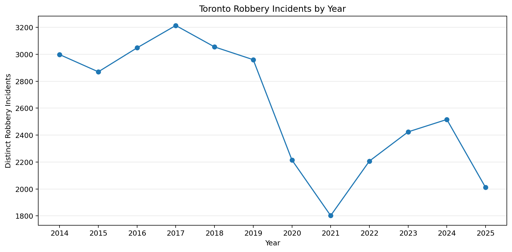
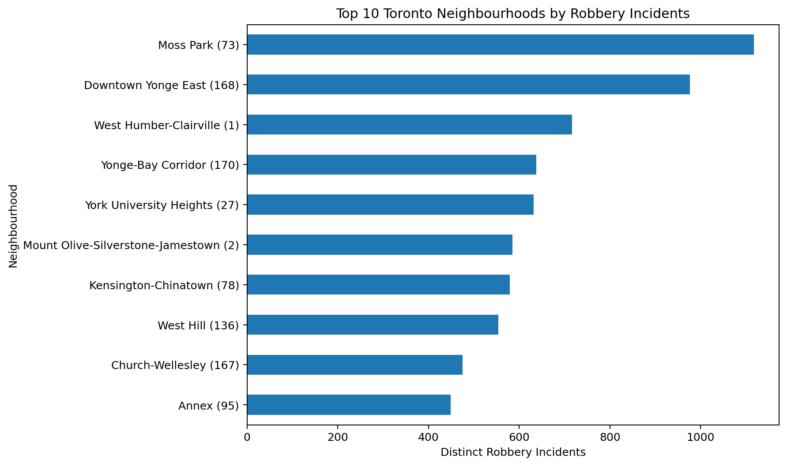
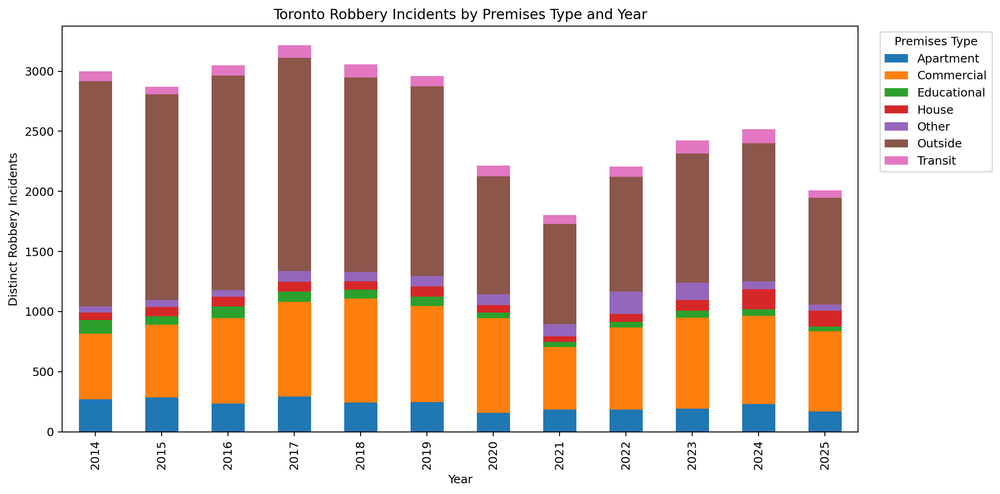
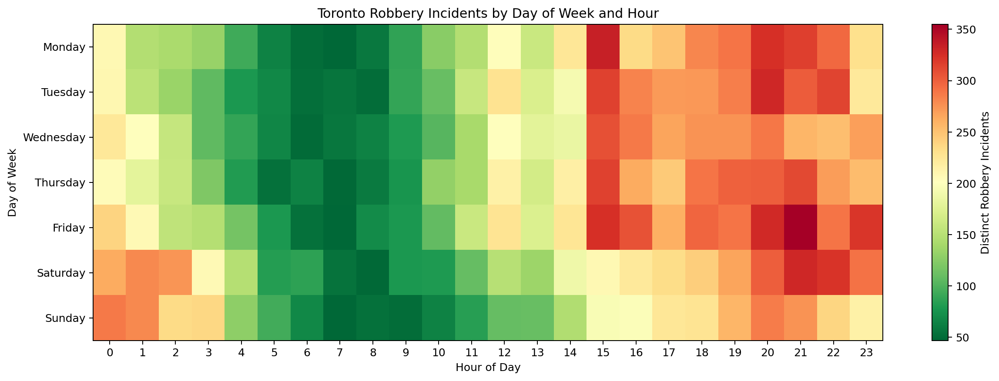
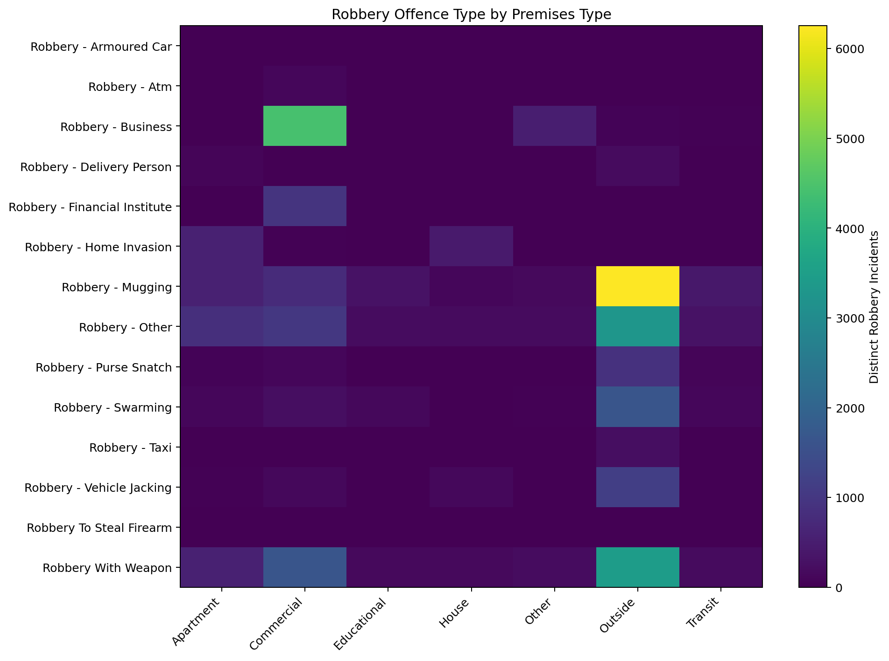
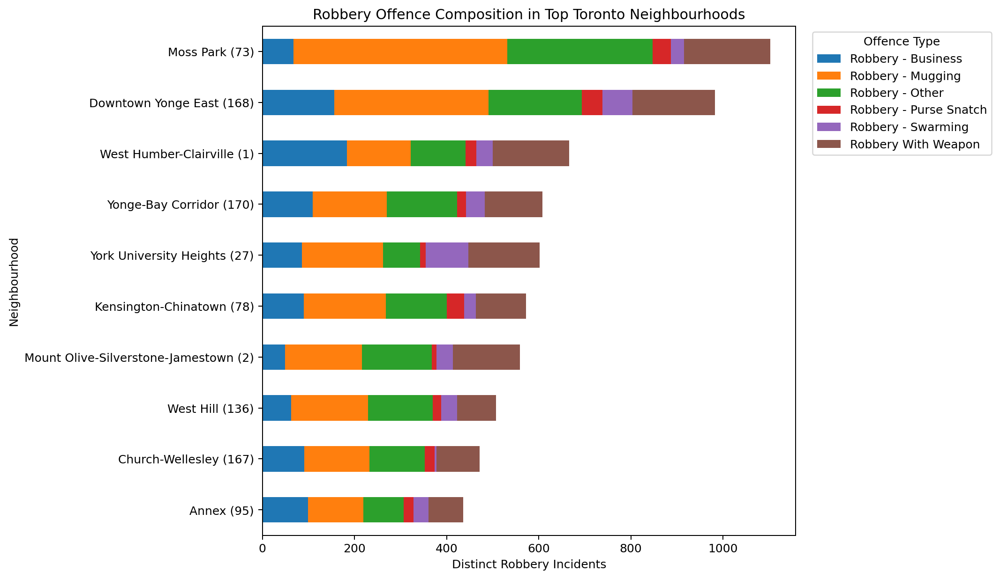
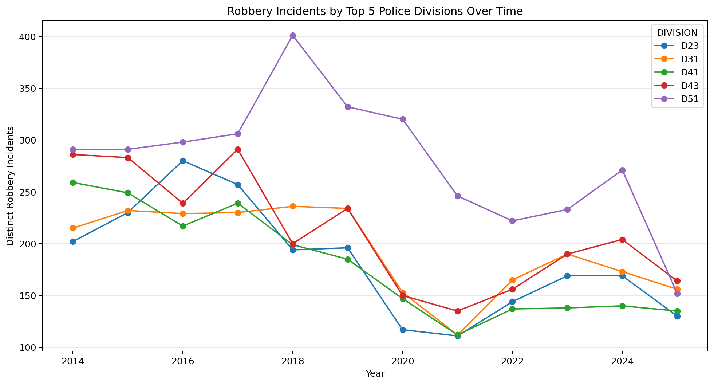

# 🚔 Toronto Robbery Open Data Analysis

An end-to-end exploratory data analysis project using **Toronto Police Service (TPS) Robbery Open Data** to study how reported robbery incidents vary over time, across neighbourhoods, premises types, offence categories, and police divisions.

The project was completed in two stages:

1. 📗 **Excel / Power Query / PivotTables** were used to clean the original data, validate fields, build interactive summaries, and explore the dataset visually.
2. 🐍 **Python / Jupyter / pandas / NumPy / Matplotlib** were then used to reproduce the analysis programmatically, create reusable visualizations, and export a cleaned analysis-ready dataset.

The goal was not only to create charts, but to build a reproducible workflow that moves from **raw public data → cleaned data → structured analysis → visual insights**.

---

## 🎯 Project Goals

This project aims to answer several practical questions about robbery incidents in Toronto:

- How have robbery incident totals changed from **2014 to 2025**?
- Which Toronto neighbourhoods recorded the highest number of distinct incidents?
- Which types of premises are most frequently associated with robbery incidents?
- At what days and hours are incidents most concentrated?
- How do offence categories differ across premises types?
- Which police divisions recorded the highest totals, and how did their trends change over time?

---

## 📊 Data Sources

The data used in this project comes from the **Toronto Police Service Public Safety Data Portal**.

- **Robbery Open Data:** https://data.tps.ca/datasets/TorontoPS::robbery-open-data/about
- **TPS Community Safety Indicators:** https://data.tps.ca/pages/community-safety-indicators

The Robbery Open Data dataset is the primary source used for the analysis. The Community Safety Indicators page is included as related TPS public-safety context.

> **Note:** This project is a descriptive analysis of publicly available records. It is not intended to predict individual behaviour or provide operational policing guidance.

---

## 🗂️ Dataset Overview

The original dataset contains incident-level robbery records with fields related to time, location, offence type, neighbourhood, police division, and geographic coordinates.

For this analysis, the working dataset was reduced to the following fields:

| Field | Description / Use |
|---|---|
| `EVENT_UNIQUE_ID` | Unique event identifier used for distinct incident counting |
| `OCC_DATE` | Occurrence date |
| `OCC_YEAR` | Occurrence year |
| `OCC_MONTH` | Occurrence month |
| `OCC_DAY` | Day of month |
| `OCC_DOW` | Day of week |
| `OCC_HOUR` | Hour of occurrence |
| `DIVISION` | TPS police division |
| `LOCATION_TYPE` | Detailed location description |
| `PREMISES_TYPE` | Broader premises category |
| `OFFENCE` | Robbery offence category |
| `HOOD_158` | Neighbourhood code |
| `NEIGHBOURHOOD_158` | Toronto neighbourhood name |
| `LONG_WGS84` | Longitude |
| `LAT_WGS84` | Latitude |
| `DASHBOARD_YEAR` | Helper field used to constrain the analysis to 2014–2025 |

The cleaned analysis file contains **39,598 rows** and **31,320 distinct event IDs** for the 2014–2025 analysis period.

A key data-quality decision was to use **distinct counts of `EVENT_UNIQUE_ID`** rather than raw row counts, because a single event can appear in more than one row.

---

## 🛠️ Tools Used

| Tool | Purpose |
|---|---|
| **Microsoft Excel** | Initial exploration, PivotTables, PivotCharts, slicers, heatmaps |
| **Power Query** | Column selection, type conversion, cleaning, reusable transformations |
| **Jupyter Notebook** | Reproducible analysis workflow |
| **Python** | Data processing and analysis |
| **pandas** | Data cleaning, grouping, distinct counts, pivot tables |
| **NumPy** | Helper logic and numeric operations |
| **Matplotlib** | Charts, stacked plots, line charts, and heatmaps |
| **Git / GitHub** | Version control and portfolio presentation |

---

# 🔄 Workflow

## 1. 📗 Initial Exploration in Excel

The project began in Excel because it provided a fast way to understand the structure of the data and validate useful dimensions before writing code.

### 🧹 Power Query Cleaning

The CSV was imported using **Data → Get Data → From Text/CSV → Transform Data**.

In Power Query:

- Unnecessary reporting and classification fields were removed.
- Relevant occurrence-based fields were retained.
- Data types were corrected.
- Geographic and neighbourhood fields were preserved for later analysis.
- A helper field, `DASHBOARD_YEAR`, was created to focus the project on **2014–2025**.

### 📈 Excel PivotTables

Several PivotTables were created to answer specific questions.

| Analysis | Excel PivotTable Structure |
|---|---|
| Incidents by year | Rows = `OCC_YEAR`; Values = Distinct Count of `EVENT_UNIQUE_ID` |
| Top neighbourhoods | Rows = `NEIGHBOURHOOD_158`; Values = Distinct Count |
| Premises type by year | Rows = `OCC_YEAR`; Columns = `PREMISES_TYPE`; Values = Distinct Count |
| Day × hour | Rows = `OCC_DOW`; Columns = `OCC_HOUR`; Values = Distinct Count |
| Offence × premises | Rows = `OFFENCE`; Columns = `PREMISES_TYPE`; Values = Distinct Count |
| Neighbourhood × offence | Rows = `NEIGHBOURHOOD_158`; Columns = `OFFENCE`; Values = Distinct Count |
| Division × year | Rows = `OCC_YEAR`; Columns = `DIVISION`; Values = Distinct Count |

Conditional formatting was used to convert matrix-style PivotTables into heatmaps, while PivotCharts were used for year, neighbourhood, premises, and division analyses.

This Excel phase was important because it helped establish the **business questions and analytical structure** before moving into Python.

---

## 2. 🐍 Reproducing the Analysis in Python

The second stage translated the Excel analysis into code so that the workflow became reproducible and easier to extend.

### 🧼 Cleaning and Data Preparation

The notebook:

- Loads `Robbery_Open_Data.csv`
- Keeps only the required fields
- Converts dates and numeric fields to appropriate data types
- Cleans the day-of-week field
- Restricts the analysis to **2014–2025**
- Creates a cleaned `analysis_df`
- Uses `EVENT_UNIQUE_ID.nunique()` for distinct incident counts

Example:

```python
analysis_df = df[
    df['OCC_YEAR'].between(2014, 2025).fillna(False)
].copy()

print(
    "Distinct incidents:",
    analysis_df['EVENT_UNIQUE_ID'].nunique()
)
```

### 🔁 Recreating Excel PivotTables with pandas

The Excel PivotTables were recreated using `groupby()` and `pd.pivot_table()`.

For example, the Excel **Year × Premises Type** PivotTable becomes:

```python
year_premises = pd.pivot_table(
    analysis_df,
    index='OCC_YEAR',
    columns='PREMISES_TYPE',
    values='EVENT_UNIQUE_ID',
    aggfunc=pd.Series.nunique,
    fill_value=0
)
```

This demonstrates the same analytical logic in two different environments: **Excel for interactive exploration** and **Python for reproducibility and automation**.

---

# 📸 Visual Analysis

## 📈 Robbery Incidents by Year:



This line chart shows the annual number of distinct robbery incidents from 2014 through 2025.

---

## 🏙️ Top 10 Neighbourhoods:



This ranking excludes `NSA` because it does not represent a named neighbourhood.

---

## 🏢 Premises Type by Year:



The stacked chart shows both overall annual volume and how incidents are distributed across premises categories.

---

## 🕒 Day of Week × Hour Heatmap:



The heatmap uses **green for lower incident counts and red for higher incident counts**, making time-based concentration patterns easier to identify.

---

## 🔥 Offence Type × Premises Type:



This matrix highlights how different robbery offence categories are distributed across premises types.

---

## 🧭 Offence Composition in Top Neighbourhoods:



This stacked bar chart compares the composition of major robbery offence categories across the highest-incident neighbourhoods.

---

## 🚓 Top 5 Police Divisions Over Time:



The five divisions were selected based on their total distinct incident counts over the analysis period.

---

# Key Findings

## 1. Yearly Trend

**2017 recorded the highest number of distinct robbery incidents, with 3,214**, while **2021 recorded the lowest, with 1,802**.

The annual series shows a substantial decline between 2019 and 2021, followed by an increase from 2022 through 2024. The 2025 total in this dataset is 2,011.

| Year | Distinct Incidents |
|---:|---:|
| 2014 | 2,998 |
| 2015 | 2,870 |
| 2016 | 3,048 |
| **2017** | **3,214** |
| 2018 | 3,055 |
| 2019 | 2,960 |
| 2020 | 2,215 |
| **2021** | **1,802** |
| 2022 | 2,207 |
| 2023 | 2,424 |
| 2024 | 2,516 |
| 2025 | 2,011 |

## 2. Highest-Incident Neighbourhoods

Among named neighbourhoods, the highest distinct incident totals were:

| Rank | Neighbourhood | Distinct Incidents |
|---:|---|---:|
| 1 | Moss Park (73) | 1,117 |
| 2 | Downtown Yonge East (168) | 976 |
| 3 | West Humber-Clairville (1) | 717 |
| 4 | Yonge-Bay Corridor (170) | 638 |
| 5 | York University Heights (27) | 632 |

## 3. Premises Type

**Outside locations were the dominant premises category**, with **16,229 distinct incidents**, followed by **Commercial locations with 8,462**.

| Premises Type | Distinct Incidents |
|---|---:|
| Outside | 16,229 |
| Commercial | 8,462 |
| Apartment | 2,699 |
| Transit | 1,058 |
| Other | 1,045 |
| House | 1,030 |
| Educational | 796 |

Together, Outside and Commercial locations account for most of the distinct incidents in the analysis period.

## 4. Day and Hour Patterns

Incident counts were generally lower during early-morning hours and higher later in the day.

The **highest day/hour combination was Friday at 21:00 (9 PM), with 355 distinct incidents** across the 2014–2025 period.

The heatmap is useful because it reveals time-of-day patterns that are difficult to see in a flat table.

## 5. Offence Type and Premises Type

The offence-by-premises analysis shows clear differences in where offence categories are concentrated.

Examples include:

- **Robbery - Business:** 4,426 incidents in Commercial premises
- **Robbery - Mugging:** 6,254 incidents in Outside locations
- **Robbery - Home Invasion:** 582 in Apartments and 456 in Houses
- **Robbery - Financial Institute:** 945 in Commercial premises

These relationships demonstrate why examining offence type and premises type together provides more information than looking at either variable alone.

## 6. Police Divisions

The divisions with the highest distinct incident totals were:

| Rank | Division | Distinct Incidents |
|---:|---|---:|
| 1 | D51 | 3,363 |
| 2 | D43 | 2,532 |
| 3 | D31 | 2,325 |
| 4 | D23 | 2,199 |
| 5 | D41 | 2,157 |

D51 had the highest total across the analysis period. The division trend chart also shows that incident levels changed considerably over time rather than remaining constant.

---

# Excel and Python: Why Use Both?

A major part of this project was intentionally performing the analysis in both Excel and Python.

### Excel was useful for:

- Quickly exploring an unfamiliar dataset
- Testing potential dimensions and metrics
- Building PivotTables without writing code
- Creating interactive filters and slicers
- Visually validating whether a proposed analysis was meaningful

### Python was useful for:

- Making the workflow reproducible
- Automating data transformations
- Recreating PivotTable logic with code
- Creating reusable analysis objects
- Exporting cleaned datasets and summary tables
- Making it easier to extend the project later into Power BI, statistical analysis, or additional visualizations

Using both tools demonstrates the ability to move between **business-user analytics tools** and **programmatic data analysis**.

---

# Repository Structure

A recommended repository structure is:

```text
Toronto-Robbery-Open-Data-Analysis/
│
├── README.md
├── Robbery_Open_Data.csv
├── Toronto_Robbery_Cleaned_2014_2025.csv
├── Toronto_Robbery_Dashboard.xlsx
├── main.ipynb
│
└── images/
    ├── incidents_by_year.png
    ├── top_neighbourhoods.png
    ├── premises_by_year.png
    ├── day_hour_heatmap.png
    ├── offence_premises_heatmap.png
    ├── neighbourhood_offence_composition.png
    └── top5_divisions.png
```

If the raw CSV is too large for your preferred GitHub workflow, it can instead be downloaded directly from the TPS source linked above.

---

# How to Run the Project

## Option 1: Run the Python Notebook

### Requirements

- Python 3.x
- Jupyter Notebook or JupyterLab
- pandas
- NumPy
- Matplotlib

Install the required packages:

```bash
pip install pandas numpy matplotlib jupyter
```

Clone the repository:

```bash
git clone <YOUR-REPOSITORY-URL>
cd Toronto-Robbery-Open-Data-Analysis
```

Make sure the raw data file is in the same directory as the notebook:

```text
Robbery_Open_Data.csv
main.ipynb
```

Start Jupyter:

```bash
jupyter notebook
```

Open `main.ipynb` and run the cells from top to bottom.

The notebook will:

1. Load the raw dataset
2. Keep the required columns
3. Clean and convert field types
4. Filter the analysis to 2014–2025
5. Perform data-quality checks
6. Recreate the Excel analyses with pandas
7. Generate Matplotlib visualizations
8. Export cleaned data and summary tables

## Option 2: Explore the Excel Workbook

Open:

```text
Toronto_Robbery_Dashboard.xlsx
```

The workbook contains:

- `Cleaned Data`
- `Pivot Tables`
- `Dashboard`
- `Insights`

If Excel displays an external-data security warning, only enable the connection if you trust the workbook and its local data source.

---

# Data Quality and Limitations

This analysis has several important limitations:

- The project analyzes **reported records in the TPS open dataset**, not all robbery activity that may have occurred.
- Some records have missing or unavailable neighbourhood information, represented by values such as `NSA`.
- Some latitude/longitude values are `0`, so invalid coordinates should be excluded from any map-specific analysis.
- The dataset can contain multiple rows associated with the same event. For that reason, the project consistently uses **distinct `EVENT_UNIQUE_ID` counts** when measuring incident totals.
- Yearly counts are descriptive and should not be interpreted as proof of causation.
- Comparisons between neighbourhoods are raw incident totals and are **not adjusted for population, foot traffic, land use, or other exposure factors**.

---

# Future Improvements

Possible next steps include:

- Build a polished **Power BI dashboard** using the cleaned CSV
- Add interactive filters for year, division, premises type, offence, and neighbourhood
- Create a valid-coordinate geographic map using latitude and longitude
- Compare raw incident totals with population-normalized neighbourhood rates where appropriate data is available
- Add monthly and seasonal trend analysis
- Create a dedicated date dimension for more advanced time-series analysis
- Automate the full workflow from raw TPS data to final dashboard outputs

---

# Conclusion

This project demonstrates an end-to-end analytics workflow using official Toronto Police Service open data.

The analysis began in **Excel and Power Query**, where the dataset was cleaned, explored, and summarized using PivotTables, PivotCharts, filters, and heatmaps. The same analytical logic was then translated into **Python using pandas, NumPy, and Matplotlib**, creating a reproducible version of the project that can be rerun and extended.

Across **31,320 distinct robbery incidents from 2014–2025**, the analysis identified meaningful variation by year, neighbourhood, premises type, time of day, offence category, and police division. More importantly, the project demonstrates how a public dataset can be transformed into a structured analytical workflow that combines spreadsheet-based analysis with programmatic data processing.

---

## Acknowledgements

Data source: **Toronto Police Service Public Safety Data Portal**.

- Robbery Open Data: https://data.tps.ca/datasets/TorontoPS::robbery-open-data/about
- Community Safety Indicators: https://data.tps.ca/pages/community-safety-indicators

This repository is an independent analytical project and is not affiliated with or endorsed by the Toronto Police Service.
